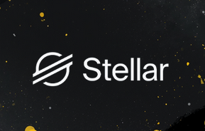

# ☀️ Stellar Bootcamp: Build The Real World
**Pau dos Ferros, IRL** | *Roteiro Definitivo e Materiais de Apoio*

Este repositório contém o passo a passo absoluto para você dominar a infraestrutura e a arquitetura da blockchain **Stellar**. O material foi construído para ser devorado.

O que você verá aqui não é teoria de tutorial. É tática de guerra para dominar mecanismos de consenso, hashing e integração de nós. ⚔️

---

## 🗺️ Mapa de Batalha (O Passo a Passo)

Siga os documentos na ordem abaixo. Você e sua equipe podem utilizá-los como guia de consulta rápida.

### 🛠️ Fase 0: Setup Local (Instalação e Ferramentas)
A base da engenharia precisa estar instalada no seu terminal (Linux, Mac ou WSL) antes do código.
1. [Instalação do Rust e Wasm Target](docs/0-instalacao/01-rust.md)
2. [Configurando seu Editor (VS Code)](docs/0-instalacao/02-editor-config.md)
3. [Instalando a Stellar CLI (Autocompletar e Redes)](docs/0-instalacao/03-stellar-cli.md)

### 🧠 Fase 1: Fundamentos
Abra a caixa preta. Entenda *por que* seu app roda na velocidade da luz.
1. [Build the Real World: Uma nova revolução financeira](docs/1-fundamentos/01-introducao.md)
2. [As Bases Sólidas da Blockchain](docs/1-fundamentos/02-basics-blockchain.md)
3. [A Evolução: Da Internet à Web 3.0](docs/1-fundamentos/03-evolucao-web.md)

### 🛠️ Fase 2: Parte Técnica
Mergulho na tecnologia fundamental e arquitetura subjacente.
1. [Cripto Hashing e Imutabilidade](docs/2-parte-tecnica/01-cripto-hashing.md)
2. [O que é um Mecanismo de Consenso? (PoW vs PoS)](docs/2-parte-tecnica/02-mecanismos-consenso.md)
3. [Stellar Consensus Protocol (SCP) e PoA](docs/2-parte-tecnica/03-stellar-consensus-protocol.md)

### 💻 Fase 3: Prática e Código (Hands-on)
É hora de construir.
1. [Agora a brincadeira começa: Código e mecanismos no Repo ParaDevs](docs/3-pratica-codigo/01-repo-paradevs-stellar.md)

---

Bora "buidar"! 🚀
